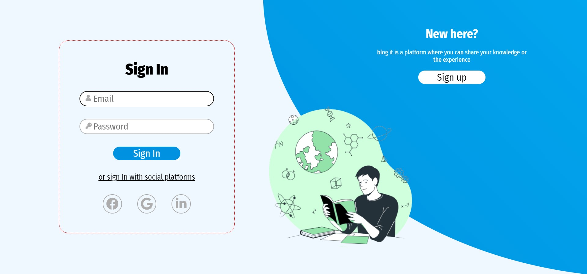
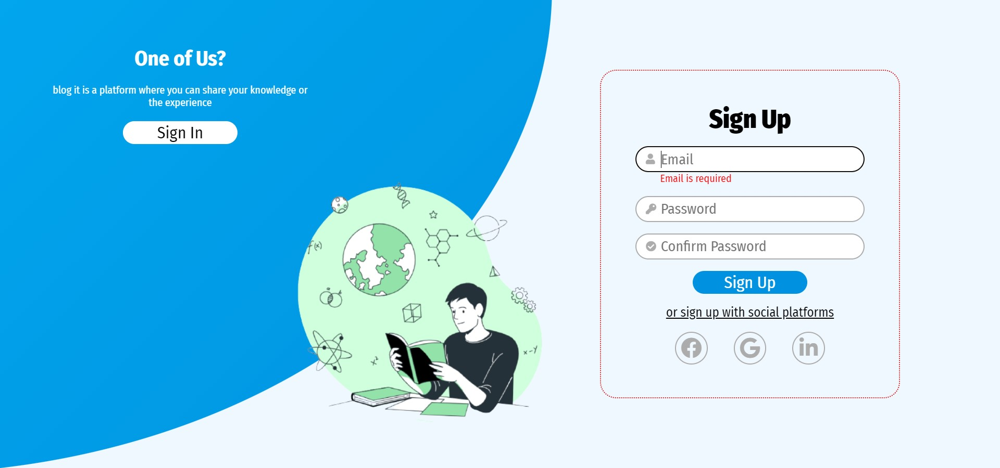
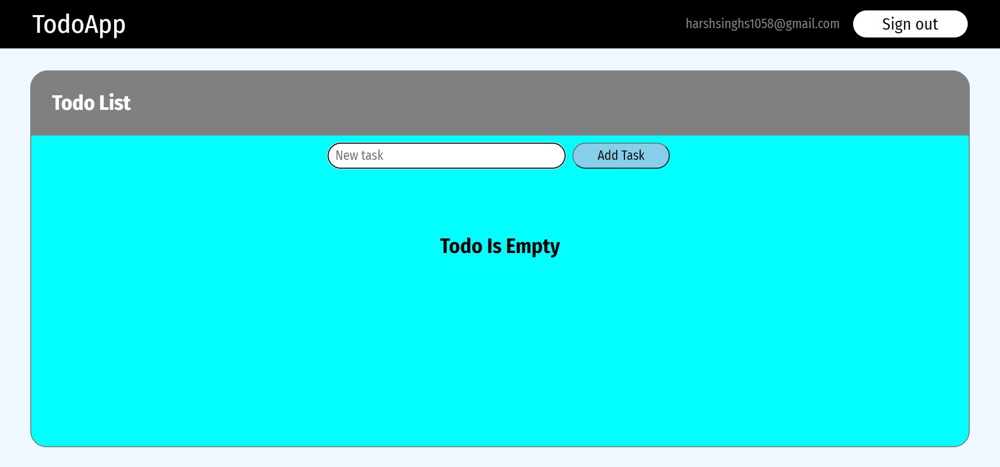
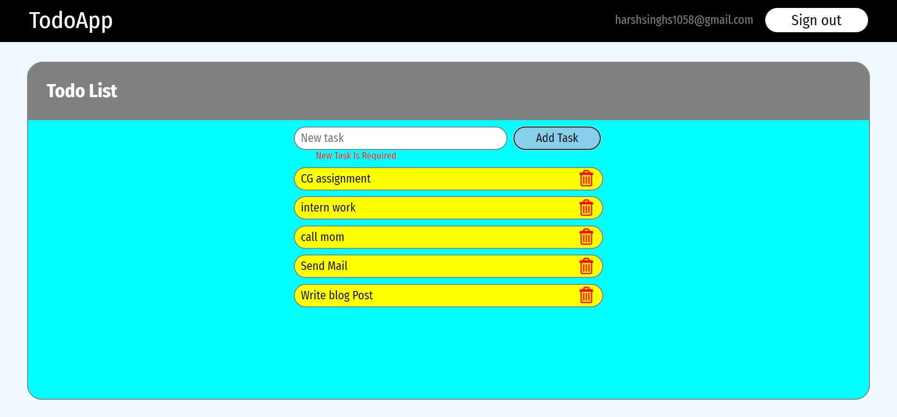
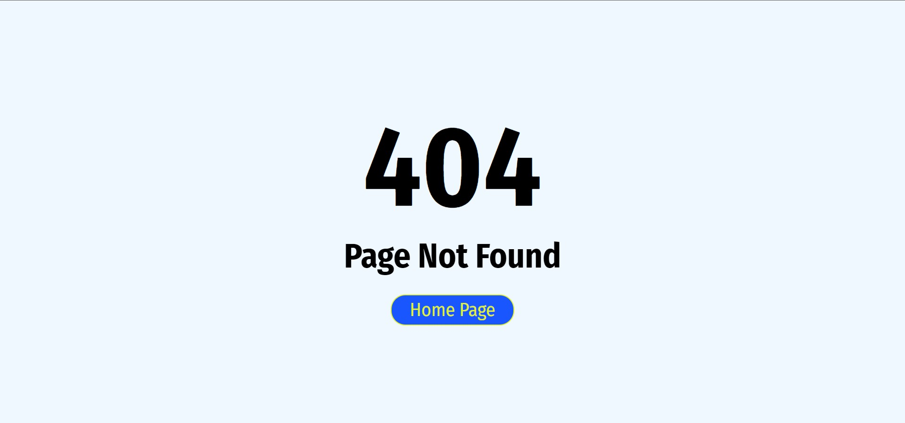

# [Front End URL](https://harshsinghs1058.github.io/todo_web_mern_frontend) - hosted on github-pages

# [Backend End URL](https://github.com/harshsinghs1058/todo_web_mern_backend) - deployed on heroku

## Stacks Used

- React js
- Mongoose
- NodeJs
- Express
- Context API

### Features

- Authentication
- Add Task
- Remove Task
- Update Task

### pages

- Sign up page
- Sign in page
- Todos page
- Page Not Found

### Note

- Currently app is unresponsive
- Sign in with Google, LinkedIn, facebook is not implemented yet

## ScreenShots

#### Sign in page

#### Sign up page

#### Todo List(Without tasks) page

#### Todo List(With tasks) page

#### Other routes page

